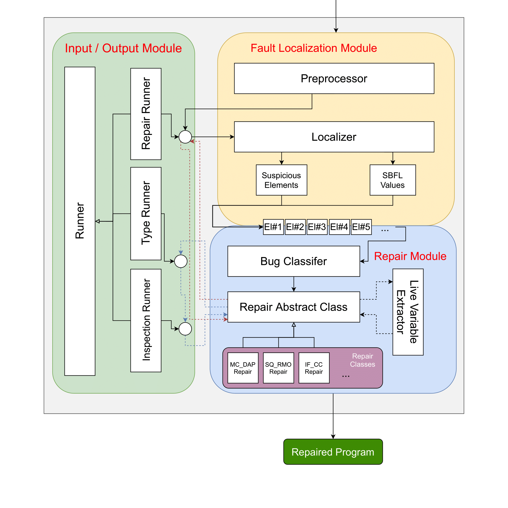

# JS-Buxter

<h4>A tool for busting JS bugs! (Automated Program Repair for JS)</h4>

<p>

In this project we have developed a tool written in Python which gets a buggy 
Javascript file with a set of tests as an input, and as the output
it gives out the repaired program that can pass all the tests.





In a nutshell, a automated program repair tool is comprised of two 
different modules which must be executed sequencially.

At first we need to find the suspicious elements in the program and
assign a suspiciousness value to each element. This stage
is called fault localization. There are many ways for finding these 
suspicious elements. The technique that was used in this project
is called Spectrum-Based Fault Localization (SBFL).

We used four different SBFL methods to calculate the suspiciousness values
for program elements:

<ul>
    <li>Tarantula</li>
    <li>Ochiai</li>
    <li>Jaccard</li>
    <li>GenProg</li>
</ul>

After we calculated the suspiciousness values, now we iterate through
all suspicious elements and apply a bug fix pattern according to the
type of the element. We used the bug fix patterns discussed in Pan et al. paper
(Except FOR_THB bug fix pattern which is a domain-specific fix pattern to
repair the security vulnerablities that "this binding" can create in Javascript).

The current bug fix patterns that the tool supports are as below:

<ul>
    <li>IF_CC</li>
    <li>IF_APC</li>
    <li>IF_RMV</li>
    <li>TY_ATC</li>
    <li>MC_DAP</li>
    <li>SQ_RMO</li>
    <li>SQ_RFO</li>
    <li>FOR_THB</li>
</ul>

So overall repair algorithm used can be summarized in the pseudo-code below:

```
 def program_repair():
   for buggyCode in possibleBuggyCodes:
      for pattern in getPatterns(buggyCode):
         getRepairAlgorithm(pattern).run()
```

</p>

# Installation and Usage

After cloning the project, you must install the required libraries.
Since some of the repair patterns use the Z3 library for static analysis,
make sure you install it properly at the project directory.


<h4>Command Line Interface</h4>

There are some examples for demonstrating how to use the tool:


Input:
```
python3 js-buxter.py -s 44 -fl ochiai
```
Output:
```
Patch:
IF_CC_Repair on "if (rr[i]>=stopIndex) ans *= (1 - pp[i])"
Repair Time:  1.4366938370000002 Seconds
```
Repaired program can be found in "./sample_code/repaired/sample_044_repaired.js"

-----

Input:
```
js-buxter.py -s 0 -r IF_CC MC_DAP -d
```
Output:
```
TestCase #1: -- PASSED
Real Value: SCALENE
Predicted Value: SCALENE
Locations: [[0, 26], [27, 53], [54, 80], [82, 303], [110, 303], [116, 172], [177, 227], [232, 280], [285, 301], [305, 335]] 

TestCase #2: -- FAILED
Real Value: ISOSCELES
Predicted Value: SCALENE
Locations: [[0, 26], [27, 53], [54, 80], [82, 303], [110, 303], [116, 172], [177, 227], [232, 280], [285, 301], [305, 335]] 

TestCase #3: -- PASSED
Real Value: ISOSCELES
Predicted Value: ISOSCELES
Locations: [[0, 26], [27, 53], [54, 80], [82, 303], [110, 303], [116, 172], [177, 227], [232, 280], [262, 280], [305, 335]] 

TestCase #4: -- FAILED
Real Value: ISOSCELES
Predicted Value: SCALENE
Locations: [[0, 26], [27, 53], [54, 80], [82, 303], [110, 303], [116, 172], [177, 227], [232, 280], [285, 301], [305, 335]] 

TestCase #5: -- PASSED
Real Value: EQUILATERAL
Predicted Value: EQUILATERAL
Locations: [[0, 26], [27, 53], [54, 80], [82, 303], [110, 303], [116, 172], [177, 227], [207, 227], [305, 335]] 

TestCase #6: -- PASSED
Real Value: INVALID
Predicted Value: INVALID
Locations: [[0, 26], [27, 53], [54, 80], [82, 303], [110, 303], [116, 172], [155, 172], [305, 335]] 

#####
Code Element:  (Suspiciousness: 0.8)
Location:  [285, 301]
return 'SCALENE'
#####

#####
Code Element:  (Suspiciousness: 0.6666666666666666)
Location:  [232, 280]
if (a == b && b != c)
        return 'ISOSCELES'
#####


...


IF_CC_Repair on "if (a == b && b != c)
        return 'ISOSCELES'"
TestCase #1: -- PASSED
Real Value: SCALENE
Predicted Value: SCALENE
Locations: [] 

TestCase #2: -- PASSED
Real Value: ISOSCELES
Predicted Value: ISOSCELES
Locations: [] 

TestCase #3: -- PASSED
Real Value: ISOSCELES
Predicted Value: ISOSCELES
Locations: [] 

TestCase #4: -- PASSED
Real Value: ISOSCELES
Predicted Value: ISOSCELES
Locations: [] 

TestCase #5: -- PASSED
Real Value: EQUILATERAL
Predicted Value: EQUILATERAL
Locations: [] 

TestCase #6: -- PASSED
Real Value: INVALID
Predicted Value: INVALID
Locations: [] 

Repaired!

Patch:
IF_CC_Repair on "if (a == b && b != c)
        return 'ISOSCELES'"
Repair Time:  3.2592488250000002 Seconds

```
Repaired program can be found in "./sample_code/repaired/sample_000_repaired.js"

-----


<table>
  <tr>
    <th>Short Switch</th>
    <th>Long Switch</th>
    <th>Domain</th>
    <th>Default</th>
    <th>Required</th>
    <th>Description</th>
  </tr>
  <tr>
    <td>-s</td>
    <td>--sample</td>
    <td>[0, 49]</td>
    <td>-</td>
    <td>Yes</td>
    <td>Choose the sample number from ./sample_code folder</td>
  </tr>
  <tr>
    <td>-h</td>
    <td>--help</td>
    <td>-</td>
    <td>-</td>
    <td>No</td>
    <td>Get the options manual</td>
  </tr>
  <tr>
    <td>-fl</td>
    <td>--fault_localization</td>
    <td>['tarantula', 'ochiai', 'jaccard', 'genprog']</td>
    <td>tarantula</td>
    <td>No</td>
    <td>Choose the fault localization method. You can choose only one.</td>
  </tr>
  <tr>
    <td>-r</td>
    <td>--repair</td>
    <td>["FOR_THB", "MC_DAP", "SQ_RMO", "SQ_RFO", "IF_RMV", "TY_ATC", "IF_APC", "IF_CC"]</td>
    <td>All</td>
    <td>No</td>
    <td>Choose the repair patterns that you want to be applied. You can choose multiple patterns. 
    If none is selected, all of them will be taken into account</td>
  </tr>
  <tr>
    <td>-r</td>
    <td>--repair</td>
    <td>["FOR_THB", "MC_DAP", "SQ_RMO", "SQ_RFO", "IF_RMV", "TY_ATC", "IF_APC", "IF_CC"]</td>
    <td>False</td>
    <td>No</td>
    <td>It will print out extra information about the repair (highly recommended to turn in on)</td>
  </tr>
</table>